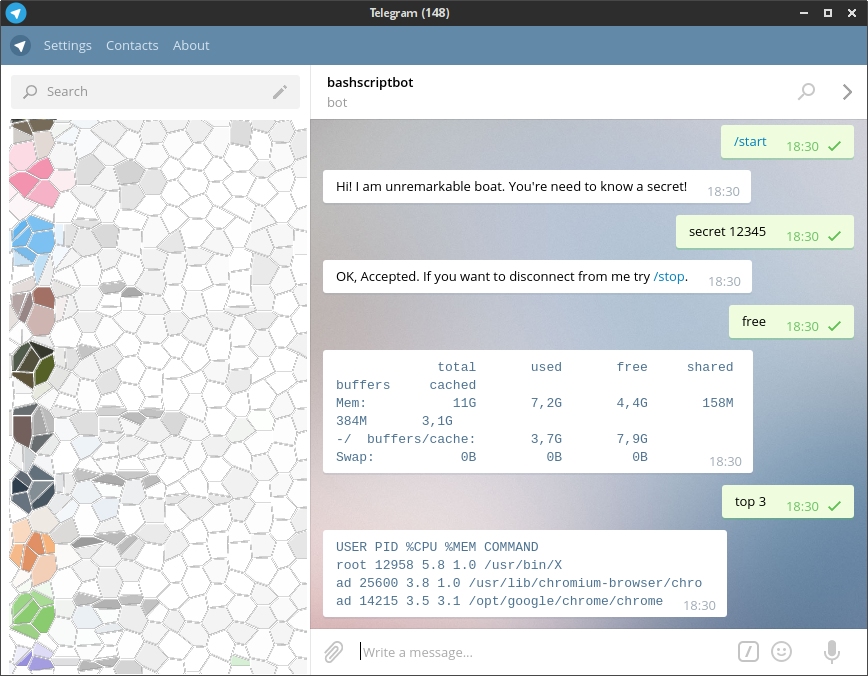

# telebot.sh
Simple telegram bash script bot for utilizing something usual

You can create private chat with bot, tell him secret word and do something on the server.

## How To use it

```
#!/bin/bash

# Define parameters
TELEBOT_KEY="<TELEGRAM API KEY>"
TELEBOT_SECRETWORD="<SOME SECRET>"

# Include
. telebot.sh/telebot.sh

<CUSTOM HANDLERS>

# Do loop
TeleBot_enable
TeleBot_goLoop
```




## Bind custom commands:

```
#!/bin/bash

TELEBOT_KEY="<TELEGRAM API KEY>"
TELEBOT_SECRETWORD="<SOME SECRET>"
. telebot.sh/telebot.sh

# Define custom command and bind it
function pong {
    local UNAME=$1; local CHATID=$2; local MSG=$3    
    TeleBot_sendMessage ${CHATID} "${MSG}"
}
TeleBot_bindCommand pong "ping"

# Define private command (after valid /secret)
TeleBot_bindCommand pong "sping" 1

TeleBot_enable
TeleBot_goLoop

```


## Broadcast message to all telebot secret users:

```
#!/bin/bash

TELEBOT_KEY="<TELEGRAM API KEY>"
TELEBOT_SECRETWORD="<SOME SECRET>"
. telebot.sh/telebot.sh

TeleBot_sendBroadCast 0 "Hi all!"
```
